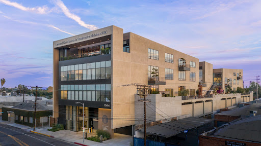
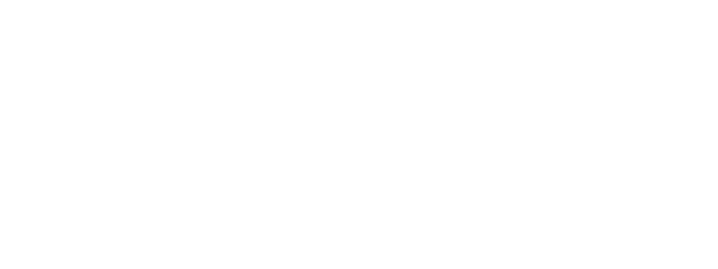
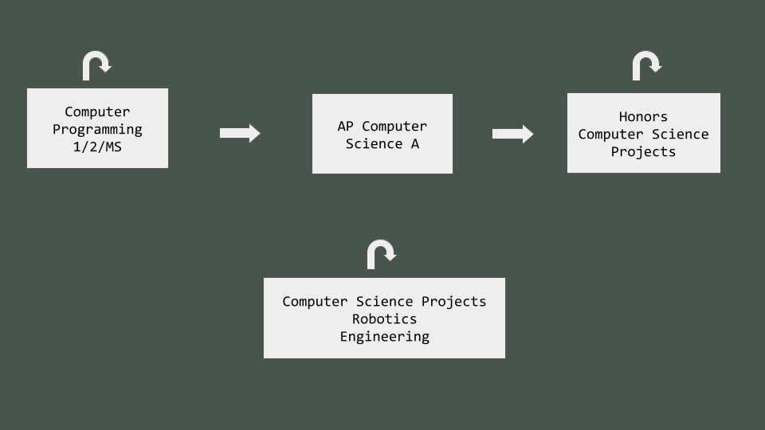

.center[
### Dr. Darren Kessner
Computer Science and Software Innovation  
Program Head   

 

### AP Computer Science

### Honors Computer Science Projects

]

 
 

[stem.marlborough.org](http://stem.marlborough.org)  

[dkessner.github.io/APCS](http://dkessner.github.io/APCS)  
[dkessner.github.io/CSProjects](http://dkessner.github.io/CSProjects)  

---

### My role

 

- 10th year at Marlborough School

- Program Head of Computer Science and Software Innovation

- Math and Computer Science Instructor

 

- Club advisor:

    * Code Violet 

    * AI in Education 

    * Juggling Club

---

### My background

* Mathematics (BS, MA), Bioinformatics (PhD)

* Worked in software development for over 25 years
    - Anti-virus security
    - Computer graphics / user interface
    - Scientific applications (biology)

* Bioinformatics software developer at Ellison Institute

 

&nbsp; &nbsp; 
&nbsp; &nbsp;
&nbsp; &nbsp;
 

---

### Computer Science curriculum

